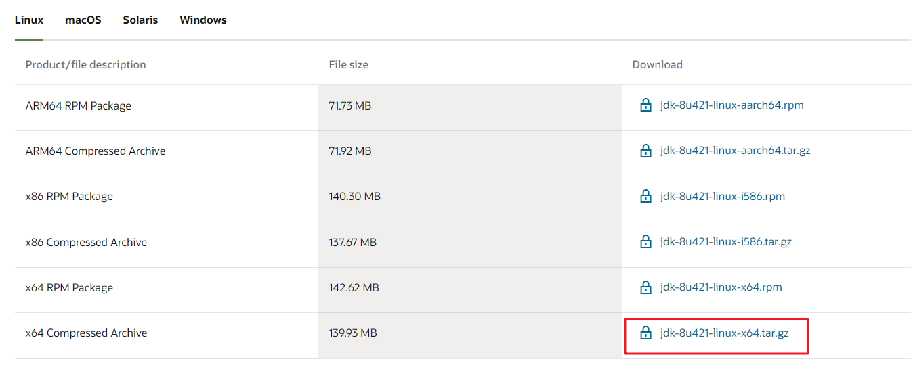
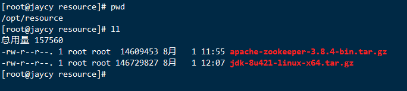

# Linux安装JDK1.8

1. 登录Oracle官网[Java Downloads | Oracle 中国](https://www.oracle.com/cn/java/technologies/downloads/)

2. 选择需要的版本下载


3. 上传到Linux服务器/opt/resource目录下（自定义目录）

   

4. ```shell
   #解压文件
   tar -zxvf jdk-8u421-linux-x64.tar.gz
   #创建文件夹(将解压后的文件放在该目录，自定义)
   mkdir -p /usr/local/java
   mv jdk1.8.0_421/ /usr/local/java/
   #配置环境变量
   vim /etc/profile
   
   #在profile文件末尾添加
   export JAVA_HOME=/usr/local/java/jdk1.8.0_421
   export CLASSPATH=.:${JAVA_HOME}/jre/lib/rt.jar:${JAVA_HOME}/lib/dt.jar:${JAVA_HOME}/lib/tools.jar
   export PATH=$PATH:${JAVA_HOME}/bin
   #保存退出
   wq
   #刷新配置
   source /etc/profile
   ```

5. 检查jdk是否安装成功

   ```shell
   java -version
   ```

   